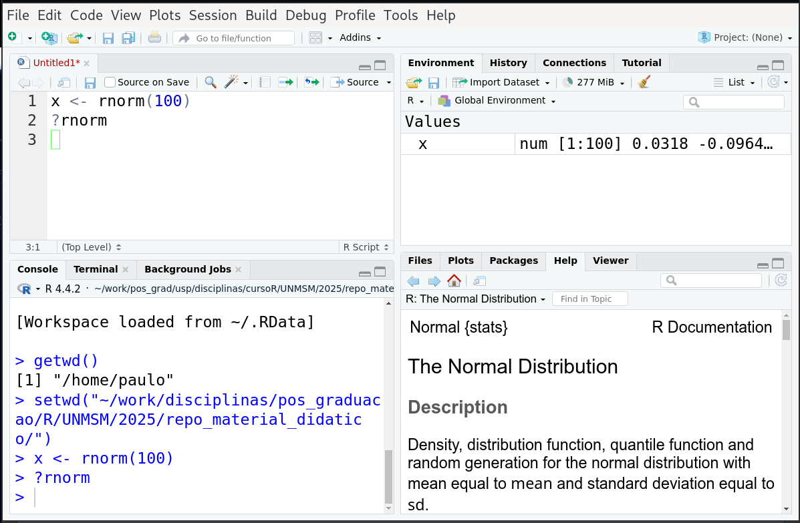
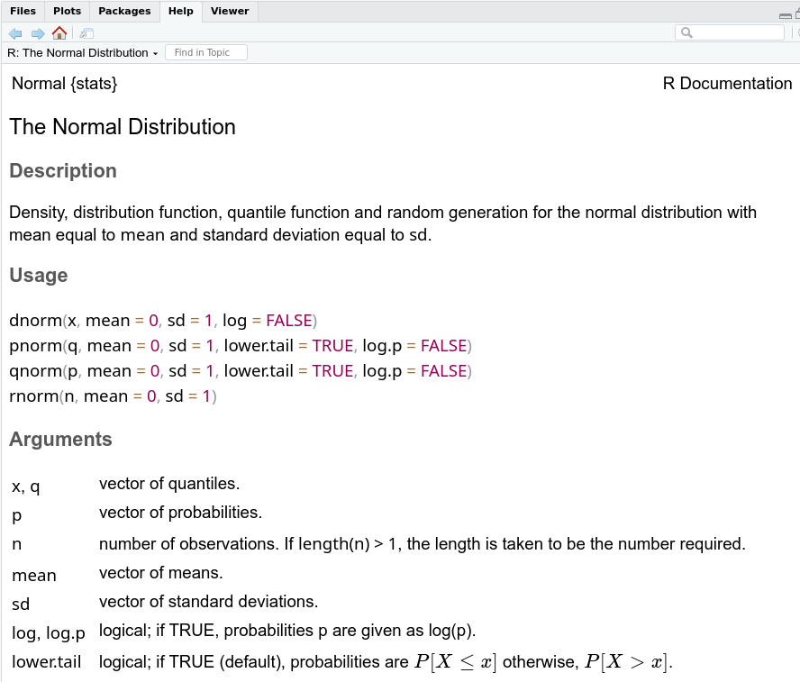

```{r setup, include=FALSE}
options(htmltools.dir.version = FALSE)
options(servr.daemon = TRUE)#para que no bloquee la sesión
knitr::opts_chunk$set(prompt = TRUE, comment = "")
```

```{r xaringan-themer, include=FALSE, warning=FALSE}
library(xaringanthemer)
library(ggplot2)
library(ggthemes)
library(knitr)
library(kableExtra)
library(dplyr)
library(tidyr)

xaringanExtra::use_share_again()
xaringanExtra::use_fit_screen()
xaringanExtra::use_tachyons()

style_solarized_light(
  title_slide_background_color = "#586e75",# base 3
  header_color = "#586e75",
  text_bold_color = "#cb4b16",
  background_color = "#fdf6e3", # base 3
  header_font_google = google_font("DM Sans"),
  text_font_google = google_font("Roboto Condensed", "300", "300i"),
  code_font_google = google_font("Fira Mono"), text_font_size = "28px",
  code_font_size="1rem"
)
# clipboard
htmltools::tagList(
  xaringanExtra::use_clipboard(
    button_text = "Copy code <i class=\"fa fa-clipboard\"></i>",
    success_text = "Copied! <i class=\"fa fa-check\" style=\"color: #90BE6D\"></i>",
    error_text = "Not copied 😕 <i class=\"fa fa-times-circle\" style=\"color: #F94144\"></i>"
  ),
  rmarkdown::html_dependency_font_awesome()
  )
## ggplot theme
theme_Publication <- function(base_size = 14, base_family = "helvetica") {
    (theme_foundation(base_size = base_size, base_family = base_family)
        + theme(plot.title = element_text(face = "bold",
                                          size = rel(1.2), hjust = 0.5),
                text = element_text(),
                panel.border = element_rect(colour = NA),
                panel.background = element_rect(fill = 'transparent'),
                plot.background = element_rect(fill = 'transparent', color = NA),
                axis.title = element_text(face = "bold",size = rel(1)),
                axis.title.y = element_text(angle=90,vjust =2),
                axis.title.x = element_text(vjust = -0.2),
                axis.text = element_text(), 
                axis.line = element_line(colour="black"),
                axis.ticks = element_line(),
                panel.grid.major = element_line(colour=NA),
                panel.grid.minor = element_blank(),
                legend.key = element_rect(colour = NA),
                legend.position = "bottom",
                legend.direction = "horizontal",
                legend.key.size= unit(0.2, "cm"),
                ##legend.margin = unit(0, "cm"),
                legend.spacing = unit(0.2, "cm"),
                legend.title = element_text(face="italic"),
                plot.margin = unit(c(10,5,5,5),"mm"),
                strip.background = element_rect(colour = NA,fill = "transparent"),
                strip.text = element_text(face="bold")
                ))
    
}

```

## Quién soy

.pull-left[
<center>
```{r pi, out.width= "40%", echo=FALSE}
knitr::include_graphics("figs/PI.jpg")
```

**PI**, Paulo Inácio Prado (pronombres: él)
]

.pull-right[
- Bachiler en Biología (1990), Maestria y Doctorado en Ecologia (1991-1999), en Brasil
- Profesor en el Departamento de Ecología del Instituto de Biociências USP
- Ecología de comunidades, ecología teórica, conservación
- Brasileño, vivo en la ciudad de São Paulo, Brasil
- Me gusta: aprender, enseñar, buena comida, cocinar, nadar, charlar y conocer a la gente.
]


---

## Para que estoy aquí

 - Para ayudarles a usar el  lenguaje R
 
 - Para que lo aprendas más rápido y fácil que yo
 
 - Al hacerlo, para mejorar mis propios conocimientos 


<center>
.left-column[
```{r mural, out.width= "100%", echo=FALSE}
knitr::include_graphics("figs/Painel.Paulo.Freire_cropped.JPG")
```
]
</center>

.right-column[
> «Nadie educa a nadie, nadie se educa a sí mismo, las personas se educan entre sí, mediadas por el mundo»
>
> Paulo Freire
]

---

## Estratégias pedagógicas

.pull-left[

- Clases dialogadas
 
- Tutoriales en R (swril)

- Ejercícios (notaR)
 
- Todos los recursos de aprendizaje en https://pilaboratory.github.io/R_UNMSM/
 
- Los recursos estarán disponibles a medida que avancemos

]
 
 .pull-right[

```{r autonomia, echo=FALSE, out.width=896, fig.align='center'}
include_graphics("figs/autonomia.jpg")
```
 
]
 
---


## Programa

```{r shedule, echo=FALSE}
read.csv("../programa.csv") |>
  kbl() |>
  kable_styling()
```

---

## ¿Qué es el lenguage R?
.left-column[
```{r rlogo, echo=FALSE, fig.align='center'}
include_graphics("figs/Rlogo.png")
```
]

.right-column[

- Un potente lenguaje para el análisis de datos y gráficos;

- Software libre creado y mantenido por una gran comunidad de colaboradores;

- La comunidad creó miles de aplicaciones y pone a disposición mucha ayuda;

- Se inició en 1990 a partir del lenguage S;

- El equipo central de R (*R Core Team*) está dirigido por una organización sin fines lucrativos;

]

---
## Para más veáse `https://www.r-project.org/`

```{r site, echo=FALSE, fig.align='center', out.width="60%"}
include_graphics("figs/rproject_site.png")
```

---
class: middle

## Programación funcional orientada a objetos

.bg-white.b--brblack.ba.bw2.br3.shadow-5.ph5.mt1[
«Todo en R es un objeto, y todo lo que haces es una llamada a una función.»

.left[— Ross Ihaka y Robert Gentleman]

]

---

## Comandos y funciones
##### Multiplicación
```{r comandos}
2*2
```
--

##### Raíz cuadrada de una multiplicación
```{r comandos2}
sqrt( 2*2 )
```
---
## Comandos y funciones
##### Log base 2 de la raíz cuadrada de una multiplicación
```{r comandos3}
log2( sqrt( 2*2 ) )
```
--

##### Lo mismo con operador *pipe*
```{r comandos_pipe}
2*2 |> sqrt() |> log2()
```
---


## Más funciones

##### Combinación de valores en un vector
```{r mas_funciones}
c(1, 10, 100)
```
--

##### Suma de los elementos de un vector
```{r mas_funciones2}
sum( c(1, 10, 100) )
```
---
## Asignación

##### Assigna un vector a `x`
```{r asignacion}
x <- c(1, 10, 100)
```
--
##### Assigna a `y` la suma del contenido de `x`
```{r asignacion2}
y <- sum(x)
```
--
##### Para ver el contenido escribe el nombre del objeto
```{r asignacion3}
y
```

---
## Programación funcional orientada a objetos

.left-column[
```{r chambersbook, echo=FALSE, fig.align='center'}
include_graphics("figs/chambers_book_cover.jpg")
```
]
.right-column[

- En R, los datos, las funciones y los resultados se tratan como
  objetos.
  
- Cada acción que realizas (por ejemplo, cálculos, manipulación de
  datos, gráficos) se ejecuta mediante funciones.
  
- En R el análisis estadístico es una **secuencia de manipulaciones de
  objetos**.
  
- R es un lenguage para **programar con datos**.
]


---

## RStudio

```{r , echo=FALSE, fig.align='center', out.width="60%"}

```
---

## Ventana de comandos (R consola)

```{r , echo=FALSE, fig.align='center', out.width="60%"}
include_graphics("figs/Rstudio_consola.png")
```
---

## Ventana de códigos (*scripts*)

```{r , echo=FALSE, fig.align='center', out.width="60%"}
include_graphics("figs/Rstudio_script.png")
```
---

## Ventana del espacio de trabajo (*worksapce*)

```{r , echo=FALSE, fig.align='center', out.width="60%"}
include_graphics("figs/Rstudio_workspace.png")
```
---

## Ventana de ayuda y gráficos

```{r , echo=FALSE, fig.align='center', out.width="60%"}
include_graphics("figs/Rstudio_plots.png")
```
---


## Ayuda

.pull-left[
```{r rnormhelp, echo=FALSE, fig.align='center'}

```
]

.pull-right[
- `help(rnorm)`, `?rnorm`
- Cuadro de búsqueda en la ventana de ayuda/gráficos en RStudio
- Formato estándar
- Secciones más importantes: 
  - *Usage*: comandos de uso 
  - *Arguments*: argumentos 
  - *Value*: lo que te devuelve 
  - *Examples*: ejemplos de uso
]

---

## ¡Vámonos!

.left-column[
```{r , echo=FALSE, fig.align='center'}
include_graphics("figs/bora-la.jpg")
```
]

.right-column[

1. Descargue el archivo de los tutoriales del enlace abajo en su directorio de trabajo.

2. En la línea de comando en RStudio escribe `library(swril)`

3. En la línea de comando de RStudio escribe `install_course()`

4. Se abrirá una ventana de selección de archivos. Navegue por los directorios hasta encontrar el archivo que ha descargado y haga clic en él.

5. Debes ver el mensaje `Course installed successfully!`

]

---

## ¡Vámonos!

.left-column[
```{r , echo=FALSE, fig.align='center'}
include_graphics("figs/bora-la.jpg")
```
]

.right-column[

6. En la línea de comando de RStudio escribe `swril()`

7. Debes ver el  mensaje `Please choose a course, or type 0 to exit swirl.` 

8. Introduzca el número del curso `Tutoriales UNMSM v#` 

10. A el mensaje `Please choose a lesson, or type 0 to return to course menu.` introduzca el número 1.
           
]

---

## Vectores

* Una collección ordenada de elementos.
* El objeto básico en R, que basa la mayoría de las operaciones.

--
##### Asigna un vector con 4 valores numéricos a `y`
```{r }
y <- c(1804, 1854, 1865, 1888)
y
```
--

##### la función `length` devuelve la longitud de un vector

```{r }
length(y)
```
---


## Operaciones con vectores

* R empareja los elementos de vectores y aplica la operación a cada pareja.
* En R eso se nombra "vectorización"

--

##### Sustrae un vector de longitud 4 de otro de la misma longitud

```{r }
a <- c(1.1, 2.2, 3.3, 4.4)
b <- c(0.1, 0.2, 0.3, 0.4)
a - b
```
---

## Reciclaje de vectores

##### ¿Por qué es igual el resultado?

```{r }
a <- c(1.1, 2.2, 3.3, 4.4)
b <- c(1, 1, 1, 1)
a - b
a - 1
```
---

## Reciclaje de vectores de tamaños diferentes

* R automáticamente *repite los elementos del vector más corto* para
  que coincida con la longitud del vector más largo.
* Muy útil, pero és importante entenderlo para evitar resultados inesperados.
* R te avisa si la longitud del vector más largo no es un múltiplo del más corto.

##### Sustrae vector de 2 elementos de vector de 5 elementos
```{r }
c(1, 2, 3, 4, 5) - c(1, 2)
```
---

## Vectores de caracteres

* Los elementos de un vector dese tipo son cadenas de caracteres
* El reciclaje vale para vectores de otros tipos

##### Asigna vector de caracteres al objeto `colores`
```{r }
colores <- c("rojo", "azul", "verde")
colores
```
##### Combina las cadenas de dos vectores
```{r }
paste(colores, "intenso")
```

---

## Vectores lógicos

* Tiene valores FALSE o TRUE (sin comillas)
* A menudo resultan de pruebas logicas (`>`, `<`, `==`, `!=`)

##### Prueba valores mayores que 1 en un vector numérico
```{r }
c(0.25, 0.99, 1, 2, 3) > 1
```

##### Prueba las cadenas que no corresponden a "rojo" en un vector de caracteres
```{r }
c("rojo", "azul", "verde") != "rojo"
```

---

## Operaciones con Vectores lógicos

* Operados lógicos booleanos: `&` (AND), `|` (OR), `!` (NOT), 


##### Prueba valores mayores que 1 y  menores que 3
```{r }
a <- c(0.25, 0.99, 1, 2, 3)
a > 1 & a < 3
```

##### Prueba las cadenas que corresponden a "rojo" o a "azul"
```{r }
colores <- c("rojo", "azul", "verde")
colores == "rojo" | colores == "azul"
```

---

## Operaciones con vectores lógicos

* Acuerdate del reciclaje de las operaciones con vectores!


##### Prueba dos vectores del mismo tamaño
```{r }
c(1, 2, 3) > c(3, 2, 1)
```

##### Prueba vectores de longitudes diferentes y no multiplices
```{r }
c("rojo", "azul", "verde") == c("azul", "rojo") 
```
---

## Una operador sin reciclaje: `%in%`

##### Prueba que los elementos de un vector están también en otro
```{r }
c("rojo", "azul", "verde") %in% c("azul", "rojo")
c(1,2,3,4,5) %in% c(2,4)
```
---

## Valores reservados: `NA`

* `NA` (*Not available*) representa valores faltantes
* En general operaciones con `NA` resultan valores `NA`

##### Un vector numerico con un valor faltante 
```{r }
x <- c(10, 30, 40, NA)
x*2
x>25
```

##### Excepciones lógicas

```{r }
2 > 1 | NA
"rojo" == "azul" & NA
any(x>25)
```

---

## Valores reservados: `NaN`

* En R, `NaN` (*Not a Number*) representa un resultado numerico matematicamente indefinido.
* Asi como para `NA`, en general operaciones con `NaN` resultan  `NaN`.

##### Operaciones matematicamente indefinidas
```{r }
0/0
log10( c(-1, -10, 1, 10) )
```

##### Operaciones con `NaN`
```{r }
NaN + 1
log(NaN)
```

---

## Valores reservados: `Inf` y `-Inf`

* En R, `Inf` y `-Inf` representa los concepto de infinito positivo y negativo. 
* Es una constante incorporada que se utiliza para indicar valores que
  exceden el rango representable de números en cálculos, o resultados
  de operaciones que matemáticamente producen infinito.

##### Excede el rango representable por vector numerico
```{r }
1000^1000
-1000^1000
```

##### Matematicamente producen infinito
```{r }
1/0
log(0)
Inf - 10000000000000000000
```

---

## Clases de vectores

* La clase de un vector indicam el tipo de dato que tienen
* Por ejemplo, numericos, characteres, lógicos
* Se verifica la clase con las funciones `class` y `is.*`

##### Aplica la funcción `class` a vectores

```{r }
a <- c(1, 2, 3, NA, NaN)
class(a)
b <- c("A", "B", "C", NA)
class(b)
```

##### Aplica funcciónes `is.*` a vectores

```{r }
is.numeric(a)
is.logical(a > 1)
```

---

## Coerción implícita

* Si intenta crear un vector con elementos de tipos diferentes, R va a buscar una manera de hacerlos todos de un tipo solo.
* Llamamos a eso **coerción implícita**

##### Un solo caracter en un vector lógico

```{r }
a <- c(T, "F", T)
a
class(a)
```


---

## Coerción implícita

* Como la coerción implícita se pasa entre bastidores, puede pasar desapercibida y causar problemas.


##### Un lógico en un vector de ceros y unos

```{r }
a <- c(FALSE, 1, 2, 3 )
a
class(a)
```
---

## Coerción explícita

* A veces la coerción entre clases es posible y la necesitas.
* Puede hacer eso con las funciones de la família `as.*`.


##### Coerción de un vector numérico en lógico
```{r }
a <- c(1,1,0,1)
class(a)
a
a <- as.logical(a)
class(a)
a
```

---

## Coerción explícita


##### Coerción de un vector caracteres en numerico
```{r }
b <- c("1","10", "100")
b
class(b)
b <- as.numeric(b)
class(b)
b
```

---

## La clase `factor`

* Un `factor` es una clases para variables categoricas.
* Puedes hacer un factor con números, caracteres o mismo logicos.
* Cada valor diferente en su vector se convierte en un nivel de su variable categórica.

##### Coerción de un vector caracteres en factor
```{r }
grupo <- c("control", "control", "arena", "arena")
class(grupo)
grupo <- as.factor(grupo)
class(grupo)
grupo
```

---

## La clase `factor`

* La conversión en factores es la coerción explícita más común en R. 
* Hay una función `factor` que hace esto, con mucha flexibilidad.

##### Convierte un vector caracteres en factor
```{r }
grupo <- c("control", "control", "arena", "arena")
grupo <- factor(grupo, levels = c("control", "arena"))
grupo                
```

---

## Matrices

* Objetos de la clase `matrix` son vectores de 2 dimensiones.
* Se crea una matriz en R con la función de `matrix`

##### Matriz con los números 1 a 12, de 4 filas y 3 columnas
```{r }
m <- matrix(1:12, nrow=4, ncol=3)
class(m)
m
```

---

## Listas

* Listas son colecciones de objetos de diferentes clases
* Se crean con la funcción `list`

##### Una lista con una matriz, un número y un vector de caracteres
```{r }
list(m, 13, c("A", "B", "C"))
```

---

## *Dataframes*

* *Dataframes* son listas de vectores de la misma longitud.
* Se utilizan para almacenar tablas de datos. 
* Son una de las clases más usadas en analisis estadísticos.
* Se crean con la función `data.frame`

###### Un *dataframe* con una variable de caracteres y una variable numérica

```{r }
continente <- c("Sudamérica", "Norteamérica", "Sudamérica")
y <- c(1854, 1865, 1888)
data.frame(year = y,  cont = continente)
```

---
