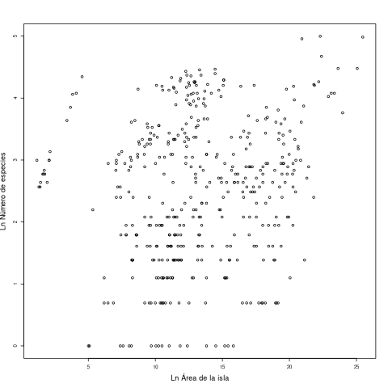

```{r setup, include=FALSE}
knitr::opts_chunk$set(echo = FALSE)
```


# Slides

```{r slides}
#| eval: true
xaringanExtra::embed_xaringan("03_graficos/slides.html")
```

# Tutoriales

Del curso en `swril` [Programación estadística en R](https://swirlstats.com/scn/estadistica.html), de Ismael Frenández, UNAM. 

Para eso ingressa eses comandos en la consola de R:

```{r , eval=FALSE, echo=TRUE}
library(swirl)
swirl::install_course_github("ifunam", "programacion-estadistica-r")
swirl()
```
Escoge el curso "`programacion-estadistica-r`" e entonces las lecciones 

* 7: Graficacion
* 8: Parametros en el Sistema de Graficos


# Ejercicios

Aquí se reproducen los enunciados de los ejercícios de notaR de esa unidad.

## Graficación

En este ejercicio usaremos el  *data frame* `islas.sel`,  que hás creado y trabajado en los ejercícios precedentes. 

1. Inicia tu script R con los códigos que has utilizado para resolver los ejercicios [Leyendo Datos](http://notar.ib.usp.br/exercicio/128), [Leyendo Más Datos](http://notar.ib.usp.br/exercicio/130), [Añadir Variables](http://notar.ib.usp.br/exercicio/131), [Variables Categoricas](http://notar.ib.usp.br/exercicio/132),  [Tablas de Agregación](http://notar.ib.usp.br/exercicio/133) y [Filtrado de Datos](http://notar.ib.usp.br/exercicio/134). Así que tu código debe crear en  tu espacio de trabajo los objetos que necesitas para ese ejercício. 

2. Añade a su *script* los comandos que haigan un histograma de la variable `species.richness` de lo objeto `islas.sel`. El título del eje X debe ser «Riqueza de espécies» y el título del eje Y debe ser «Número de islas». Los títulos de los ejes deben incrementarse en 1,5 veces y los números de los ejes deben incrementarse en 1,25 veces (véanse los argumentos `cex.axis` y `cex.lab` en la ayuda de `par`, que todavia se aceptan en la función `hist`). Los intervalos de clase del histograma devem ser de 15, empezando en zero hasta 150 (véanse el argumento `breaks` de `hist`, y también la función `seq` para crear secuencias). El histograma no debe tener título (véanse el argumento `main` de la función `hist`).

3. Añade al histograma una línea vertical roja, que marque la média del número de espécies por isla del *data frame* `islas.sel`.

4. No incluyas en tu *script* ningún comando para guardar el gráfico en un fichero (como `png`, `pdf`, etc). Tampoco incluyas en tu código comandos que abran ventanas gráficas, como `X11` o `quartz`.

El sistema evaluará la similitud de la imagen generada por su código con la imagen siguiente:


