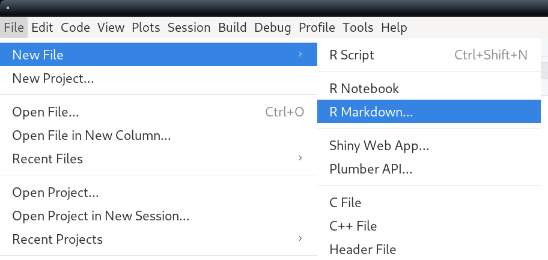
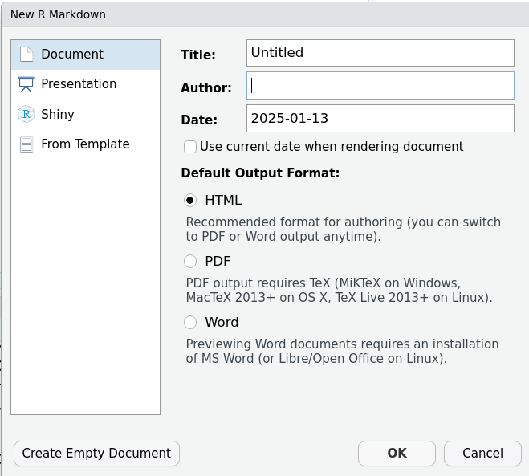
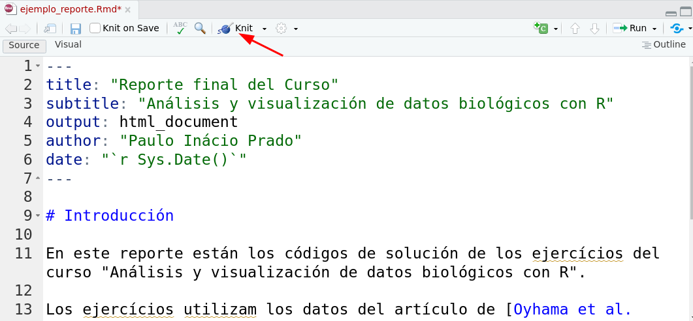

El objetivo de este ejercicio es organizar los códigos de los
ejercicios realizados en notaR en un informe Rmarkdown.

## Preparación

1. Cree una carpeta en su computadora para almacenar todos los archivos de su reporte. Copia para esa carptea los archivos [islas.csv](http://notar.ib.usp.br/arquivo/56) y [archipielagos.csv](http://notar.ib.usp.br/arquivo/52).

2. Abra RStudio e indique como directorio de trabajo la carpeta que acaba de crear. Puede hacerlo de trés modos: 
   - Ingrese en la linea de comando `setwd("ruta")`, donde `"ruta"` es la ruta hacia su carpeta, entre comillas.
   - Por el menu de RStudio *Session* > *Set Working Directory* > *Choose Directory*
   - Tecleando Ctrl+Shift-H (Ctrl+Mayúsculas+H)

3. Cree un nuevo archivo *rmarkdown* con el menu *File* > *New File* > *Rmarkdown*

```{r , echo=FALSE}

```

4. En el quadro de dialogo que se abre, pulse el botón *Create Empty Document*.

```{r , echo=FALSE}

```

## Cree la sección YAML

El encabezado YAML debe estar ubicado a la parte superior de su documento *rmarkdown* y define los metadatos y características del documento que resultará de su documento *markdown*. Empezaremos con una sectión YAML simple :

1. copia y pega el codigo a seguir en el início de su archivo. 
```
---
title: "Reporte final del Curso"
subtitle: "Análisis y visualización de datos biológicos con R"
output: html_document
author: "Nombre"
date: "`r Sys.Date()`"
---
```
2. Cambie "Nombre" por su nombre y apellido en el encabezado que has pegado.
3. Guarda el archivo con el nombre "nombre_apellido_reporte_curso_R.Rmd", con el menu *File* > *Save As* . 

#### Notas 
Para saber más sobre el YAML y como cambiarlo mira ese artículo: https://rpubs.com/gustavomtzv/874870.

## Escriba la introducción

1. Abajo de la sección YAML, teclee enter para crear una línea en blanco. En la línea siguiente, escriba «#Introdución». Eso crea un título de sección.
2. Teclee enter para crear un nueva línea en blanco. Ahora escribas una pequeña introducción, explicando que se trata de los ejercicios del curso "Análisis y visualización de datos biológicos con R". Explica también que en estos ejercicios se utilizarán datos del artículo de Oyhama et al. 2021, e incluye el enlace a dicho artículo, que es este: https://onlinelibrary.wiley.com/doi/10.1111/jbi.14149

3. Llama a *knit* para producir la salida de su reporte, que será un archivo hypertexto (*html*). Para eso, haz clic en el butón de *knit*, o teclee *Ctrl* + *Shift* + K.

```{r , echo=FALSE}

```

4. Se abrirá una ventana con el archivo html resultante de la compilación de su archivo rmarkdown. 
5. Cada vez que quieras comprobar cómo ha quedado tu reporte, sólo tienes que volver a compilar el archivo *rmarkdown* de esta forma.

#### Notas

* Puedes hacer una jerarquía de secciones con una secuencia de caracteres «#». Por ejemplo, «##Subsección», «###Subsubsección», etc.
* Si quieres dar un otro nombre a un enlace usa `[nombre del enlace](url)`.
* Si tienes otras dudas a secuencia sobre el sintaxis de rmarkdown, conulte ese [la guía rápida de *markdown*](https://rmarkdown.rstudio.com/authoring_basics.html). 

## Crees la primera sección

1. Teclee *enter* para un línea en blanco. A la línea seguiente cree una sección llamada "Leyendo datos".
2. Cree una nueva línea en blanco y a seguir escriba «##Datos de las islas». Esto crea un subsección. 

### Crees la primera subsección

3. Cree una nueva línea en blanco. A continuación, elabore una lista numerada que describa cada paso que has realizado en el ejercício [Leyendo datos](http://notar.ib.usp.br/exercicio/128), en notaR. Vease [el guia rápido de *markdown*](https://rmarkdown.rstudio.com/authoring_basics.html) para la sintaxis de listas numeradas.
4. Después de la lista escribas en una nueva línea "sigue el código de la solución:". Cree mas una línea en blanco.

#### Incluyas un bloque de código R

Ahora vamos a incluir en el su archivo *rmarkdown* los códigos R que has creado para resolver este primer ejercicio. Lo hacemos de manera que estos códigos se ejecuten cuando se compile tu archivo *rmarkdown*. Para ello, necesitamos crear un bloque de código ("*chunk*").

1. Teclee *Ctrl* + *Shift* + I, o pulse el botón *Insert a new code chunk*

```{r , echo=FALSE}
knitr::include_graphics("Rstudion_buton_chunk.png")
```

2. Esto insertará el siguiente código en su archivo markdown:

````markdown
`r ''````{r}

```
````

3. Nombra el bloque de código así:

````markdown
`r ''````{r solucion_ej_1}

```
````

4. Ahora incluye en el bloque los códigos R de su solución del ejercício. Por ejemplo (la ellipsis indica los comandos que se siguen en tu código):

````markdown
`r ''````{r}
islas.raw <- read.csv("islas.csv")
...
```
````

5. Guarde y compile su arquivo.
6. Escribe en la línea a seguir "Sigue la estructura del objeto que resultou de eses código:"
7.   Ahora cree un nuevo bloque de código para mostrar las primeras lineas del objeto isla con el comando la structura del objeto, con el comando `str(islas)`.
8. Guarde y compile el archivo. Ahora verás en el documento compilado el resultado del último bloque de código.

### Crees la segunda subsección

1. Cree una subsección "Datos de los archipielagos" 
2. Escribe el primero paso que has realizado en el ejercício [Leyendo más datos](http://notar.ib.usp.br/exercicio/130), como el primero paso numerado de una lista.
3. A continuación incluyas un bloque de código en R con los comando R que has utilizado para ese paso.
4. Repite eso para todos los pasos. Al final terá una lista numerada, con un bloque de código R a cada elemento de la lista.

## Segunda sección

Crees la segunda sección para explicar lo que hiciste para resolver el ejercício [Añadir variables](http://notar.ib.usp.br/exercicio/131). Haz también una lista numerada de los pasos, y a continuación un bloque con los códigos con su solución. Concluyas con un bloque que resulte en un resumén de las nuevas variables que has creado, con la función `summary`.

## Tercera sección

1. Cree el ancabezado de la tercera sección.
2. Haz la lista numerada de los pasos para resolver el ejercício [Tabla de agregación de datos](http://notar.ib.usp.br/exercicio/133).
3. A continuación, incluyas el bloque de códigos R con los códigos de su solución.
4. A la continuación utiliza la functión `kable` del paquete `knitr` para hacer una tabla de los objetos `islas.mean.area.log` y `islas.N` en el documento compilado. Vease la página de ayuda de `kable` para hacer un título para sus tablas, y otras opciones de formato.
5. Acuerdate de siempre guardar su archivo *rmarkdown* tecleando *Ctrl* + S. Lo compiles para chequear como va su documento de salida.

## Cuarta sección

1. Cree el encanbezado de la cuarta sección.
2. Haz la lista numerada con los pasos para la solución del ejercício [Filtrado de datos](http://notar.ib.usp.br/exercicio/134). 
3. A la continuación incluyas el bloque con su código R para la solución.
4. Concluya con la frase «el objeto islas tiene  `` `r
 nrow(islas)`  `` filas, mientras que al filtrar los datos de este objeto se obtuvo un nuevo objeto con `` `r
  nrow(islas.sel)`  `` filas.»  Guarda y compila su documento para verificar lo que resulta.
5. Hayga una conclusión equivalente para el objeto `archipielagos.sel`. 

#### Notas

En esa sección haz utilizado la sintaxis de salida de código R en línea. Eso es muy util para mencionar resultados de tu analisis en tu texto. Si los resultados cambiam, no tienes que preocuparte de buscarlos y corregirlos en el texto.

## Quinta sección

1. Cree el encabezado de la quinta sección.
2. Escibas 1-2 frases para explica que se sigue el histograma de la riqueza de espécies de las islas selecionadas en la sección anterior.
2. Incluyas un bloque de código R con su código para la solución del ejercício [Graficación](http://notar.ib.usp.br/exercicio/135). Para esa sección no necesitas hacer la lista numerada de pasos. 
3. Guarde y compile su archivo *rmarkdown*
4. Incluya la opción `echo=FALSE` en su bloque:

````markdown

`r ''````{r, echo=FALSE}
...
```
````


5. Guarda y compila tu archivo una vez más. Con esa opción el texto compilado no muestra el código, tan solo el resultado. Eso es útil para incluyes figuras en reportes y presentaciones.
6. Mira la [referencia rápida](https://rstudio.github.io/cheatsheets/translations/spanish/rmarkdown_es.pdf) de *rmarkdown* y experimenta cambiar otros argumentos de del bloque que cambiam la figura , como `fig.width`, `fig.height` o `fig.align`.

## Envia tu reporte

1. Guarda y compila su versión final del reporte
2. Comprime todo tu directorio de trabajo en un archivo zip.
3. Carga el archivo zip en ese [drive google](https://drive.google.com/drive/u/0/folders/1E7z9Y3OWHLjAaKwAgyzhmniohZZlt0mY).

