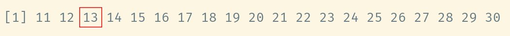
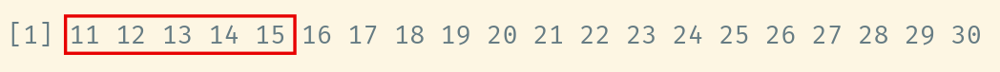
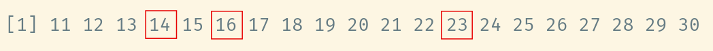
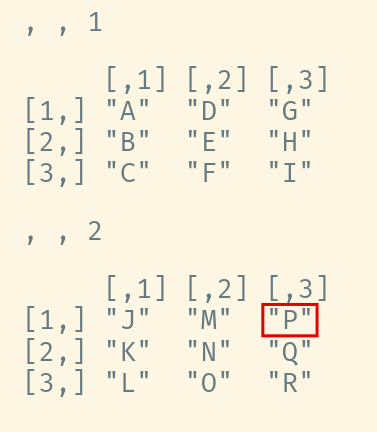
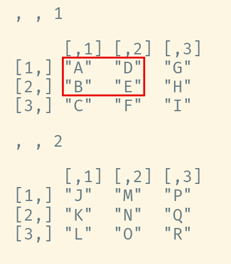
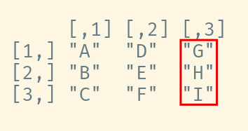

```{r setup, include=FALSE}
options(htmltools.dir.version = FALSE)
options(servr.daemon = TRUE)#para que no bloquee la sesión
knitr::opts_chunk$set(prompt = TRUE, comment = "")
```

```{r xaringan-themer, include=FALSE, warning=FALSE}
library(xaringanthemer)
library(ggplot2)
library(ggthemes)
library(knitr)
library(kableExtra)
library(dplyr)
library(tidyr)

xaringanExtra::use_share_again()
xaringanExtra::use_fit_screen()
xaringanExtra::use_tachyons()

style_solarized_light(
  title_slide_background_color = "#586e75",# base 3
  header_color = "#586e75",
  text_bold_color = "#cb4b16",
  background_color = "#fdf6e3", # base 3
  header_font_google = google_font("DM Sans"),
  text_font_google = google_font("Roboto Condensed", "300", "300i"),
  code_font_google = google_font("Fira Mono"), text_font_size = "28px",
  code_font_size="1rem"
)
# clipboard
htmltools::tagList(
  xaringanExtra::use_clipboard(
    button_text = "Copy code <i class=\"fa fa-clipboard\"></i>",
    success_text = "Copied! <i class=\"fa fa-check\" style=\"color: #90BE6D\"></i>",
    error_text = "Not copied 😕 <i class=\"fa fa-times-circle\" style=\"color: #F94144\"></i>"
  ),
  rmarkdown::html_dependency_font_awesome()
  )
## ggplot theme
theme_Publication <- function(base_size = 14, base_family = "helvetica") {
    (theme_foundation(base_size = base_size, base_family = base_family)
        + theme(plot.title = element_text(face = "bold",
                                          size = rel(1.2), hjust = 0.5),
                text = element_text(),
                panel.border = element_rect(colour = NA),
                panel.background = element_rect(fill = 'transparent'),
                plot.background = element_rect(fill = 'transparent', color = NA),
                axis.title = element_text(face = "bold",size = rel(1)),
                axis.title.y = element_text(angle=90,vjust =2),
                axis.title.x = element_text(vjust = -0.2),
                axis.text = element_text(), 
                axis.line = element_line(colour="black"),
                axis.ticks = element_line(),
                panel.grid.major = element_line(colour=NA),
                panel.grid.minor = element_blank(),
                legend.key = element_rect(colour = NA),
                legend.position = "bottom",
                legend.direction = "horizontal",
                legend.key.size= unit(0.2, "cm"),
                ##legend.margin = unit(0, "cm"),
                legend.spacing = unit(0.2, "cm"),
                legend.title = element_text(face="italic"),
                plot.margin = unit(c(10,5,5,5),"mm"),
                strip.background = element_rect(colour = NA,fill = "transparent"),
                strip.text = element_text(face="bold")
                ))
    
}
```

## Lo que veremos hoy

1. Indexación y selección de datos en objetos;
2. Cambiar y crear variables en objetos de datos;
3. Funciones de sintesis de datos

---

## La notación de indexado

* Filtra un vector por posición: `x[s]`
* `x`: vector que quieres filtrar
* `s`: vector con el criterio de busca: numérico, lógico, nombres

```{r}
mi_vector <- 11:30
mi_vector[3]
```
--



---

## Indexación numérica


```{r}
mi_vector[1:5]
```



--

##### El resultado de la selección sigue el orden del vector entre corchetes
```{r}
mi_vector[c(13,6,4)]
```



---

## Exclusión

* Enteros negativos excluyen elementos

```{r}
mi_vector[-(10:15)]
```


---

## Lógico

* TRUE seleciona, FALSE excluye

```{r}
rep(c(TRUE,FALSE),10)
mi_vector[rep(c(TRUE,FALSE),10)]
```


---

## Selección por pruebas lógicas

```{r }
fechas <- as.Date(
    c("2001-06-23", "2001-06-23", "2001-06-26", "2001-07-05", "2001-07-07",
      "2001-12-28", "2005-09-25", "2006-10-20", "2007-08-15", "2007-11-16",
      "2008-08-26", "2009-02-09", "2010-03-23", "2010-05-05", "2010-05-18",
      "2010-05-23", "2010-05-24", "2011-03-06", "2011-06-20", "2011-08-24",
      "2011-10-28", "2012-01-30", "2012-05-14", "2012-06-07", "2012-08-02",
      "2013-07-16", "2013-09-25", "2014-03-15", "2014-03-15", "2014-08-24",
      "2015-11-25", "2016-08-14", "2017-07-17", "2017-10-10", "2018-01-14",
      "2018-08-24", "2019-03-01", "2019-05-26", "2020-12-27", "2021-06-22",
      "2021-07-30", "2021-11-28", "2022-02-03", "2022-05-26", "2022-10-05",
      "2023-12-20", "2024-06-16", "2024-06-28", "2024-06-29", "2024-11-05")
    )
class(fechas)
```
---

## Selección por pruebas lógicas

```{r }
as.Date("2025-01-07") - fechas
```
--

```{r }
magnitud <- c(
    8.4, 6.1, 6.7, 6.6, 7.6, 6.0, 7.5, 6.7, 8.0, 6.8, 6.4, 6.1, 6.0, 6.2, 6.0, 6.1, 6.5,
    6.2, 6.6, 7.0, 6.9, 6.3, 6.3, 6.1, 6.2, 6.0, 7.1, 6.2, 6.3, 6.8, 7.6, 5.3, 6.3, 6.3,
    7.1, 7.1, 7.0, 8.0, 6.0, 6.4, 6.2, 7.5, 6.5, 7.2, 6.1, 6.2, 6.3, 7.2, 6.1, 6.0)
fechas[magnitud>=8]
fechas[magnitud>=8 & (as.Date("2025-01-07") - fechas)<=1000]
```

---

## Arreglos (arrays)

##### Crea un arreglo de 3 dimension 3 x 3 x 2

```{r}
mi_arreglo <- array(LETTERS[1:18], dim=c(3,3,2))
mi_arreglo
```
---

## Indexación multidimensional


.pull-left[

```{r}
mi_arreglo[1,3,2]
```
* Filtra un  arreglo por posición: `x[d1, d2, d3, ..., dn]`
* `x`: vector que quieres filtrar
* `d1, d2, d3, ..., dn`: vectores de indices de selección para la dimensión 1, 2, 3, ... n


]

.pull-right[

]
---

## Indexación multidimensional

.pull-left[
```{r}
mi_arreglo[1:2,1:2,1]
```
]

.pull-right[

]

---

## Matrices

* Tan solo arreglos de dos dimensiones

##### Selección de una ficha y todas las columnas

```{r}
mi_matriz <- matrix(LETTERS[1:9], 3, 3)
mi_matriz[2,]
```
--


---

## Matrices

##### Selección de una coluna y todas las fichas
```{r}
mi_matriz[,3]
```



---

## Selección de listas

* `x[s]` donde `x` es una lista y `s` un vector de indices o nombres.
* Devuelve **una lista** solamente con los elementos indexados o nombrados.


```{r , echo=FALSE}
df1 <- data.frame(siglo=c("XIX","XX","XXI"),empieza=c(1801,1901,2001))
mi_lista <- list(A = 1:5, B = matrix(1:6,2,3), C = df1)
```
.pull-left[

```{r }
mi_lista
```
]

--

.pull-right[

```{r }
mi_lista[2]
mi_lista["A"]
```
]


---

## Selección de elementos de listas

* `x[[s]]`,  donde `x` es una lista y `s` es **un único** indice o nombre. 
* `x$n`, donde `n` es un nombre.
* Devuelve **el elemento** indexado o nombrado.


.pull-left[

```{r }
mi_lista$A
mi_lista[[2]]
```
]

.pull-right[

```{r }
mi_lista[[1]]
mi_lista$B
```
]

---

## Dataframes

.pull-left[

##### Tan solo listas con elementos con la misma longitud
```{r }
df1
```
]

.pull-right[

##### Selección de dataframes

```{r }
df1[1]
df1["siglo"]
```
]

---

## Dataframes


.pull-left[

##### Tan solo listas con elementos con la misma longitud

```{r }
df1
```
]

.pull-right[

##### Selección de elementos
```{r }
df1[[1]]
df1$siglo
```
]

---

## Cambia valores en objetos

```{r }
mi_matriz
mi_matriz[,1] <- tolower(mi_matriz[,1])
mi_matriz
```
---

## Cambia variables en dataframes

```{r }
df1
df1$siglo <- paste("Siglo",df1$siglo)
df1
```
---

## Añade variables a dataframes

```{r }
df1$termina <- df1$empieza + 99
df1
```
---

## Tabla de frecuencias con `table`

```{r }
(fechas_year <-format(fechas, "%Y"))
table(fechas_year)
class(table(fechas_year))
```


---


## Dividir, aplicar, combinar: `aggregate`

1. Divide datos en pedazos según un criterio;
2. Aplica una función a cada pedazo;
3. Combina los resultados en un nuevo objeto.

```{r }
aggregate(magnitud, by = list(fechas_year), FUN = mean)
```

---

## `aggregate`: sintaxis de fórmulas

```{r }
sismos <- data.frame(fechas, fechas_year, magnitud)
aggregate(magnitud ~ fechas_year, mean, data = sismos)
```

---

## Dividir, aplicar y combinar: `lapply`

* Aplica una función a cada elemento de una lista
* Devuelve otra lista


.pull-left[
```{r }
mi_lista
```
]

.pull-right[

```{r }
lapply(mi_lista, is.numeric)
```
]

---

## Dividir, aplicar y combinar: `sapply`

* Aplica una función a cada elemento de una lista
* Intenta volver un vector

.pull-left[
```{r }
mi_lista
```
]

.pull-right[

```{r }
sapply(mi_lista, is.numeric)
```
]

---

## Funciones a dimensiones de un arreglo: `apply`

* Arreglos son objetos de un único tipo de datos. 
* Asi que tiene sentido aplicar funciones a cualquiera de sus dimensiones.
* La función `apply` lo hace, indicando la dimensión en su segundo argumento (`MARGIN`).

```{r }
(m1 <- matrix(c(4, 3, 2, 2, 4, 3, 3, 2, 4), nrow = 3, byrow = TRUE))
apply(m1, MARGIN = 1, sum)
apply(m1, MARGIN = 2, sum)
```
---

## Funciones a dimensiones de un arreglo: `apply`

* Arreglos son objetos de un único tipo de datos. 
* Asi que tiene sentido aplicar funciones a cualquiera de sus dimensiones.
* La función `apply` lo hace, indicando la dimensión en su segundo argumento (`MARGIN`).

```{r }
(m2 <- matrix(c("A", "B", "C", "B", "C", "A", "C", "A", "B"), nrow = 3, byrow = TRUE))
apply(m2, MARGIN = 1, paste, collapse = "")
```
---


## Que hacer ahora

.left-column[
```{r , echo=FALSE, fig.align='center'}
include_graphics("../01_introduccion/figs/bora-la.jpg")
```
]

.right-column[

#### Haiga los tutoriales:

* Subconjuntos de datos
* Funciones *apply
* Y entonces vamos a notaR
           
]

