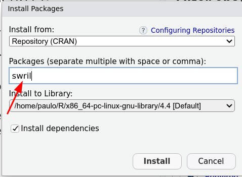

```{r setup, include=FALSE}
knitr::opts_chunk$set(echo = FALSE)
library(knitr)
library(tufte)
library(kableExtra)
```
## Bienvenida(o) a nuestro curso. 

Este es un curso creado por un estudiante de biología de toda la vida para ayudar a otros estudiantes a aprender R más fácil y rápido que él mismo. 

> «Una de las cosas más importantes que puedes hacer es dedicar tiempo a aprender un verdadero lenguaje de programación. Aprender a programar es como aprender otro idioma: lleva tiempo y entrenamiento, y no hay resultados prácticos inmediatos. Pero si superas esa primera cuesta empinada de la curva de aprendizaje, las ganancias como científico son enormes. La programación no sólo te liberará de la camisa de fuerza de los paquetes estadísticos, sino que agudizará tu capacidad analítica y ampliará tus horizontes de modelización ecológica y estadística.»
>  `r tufte::quote_footer('--- Traducción algo libre de Gotelli & Ellison, 2004. A Primer of Ecological Statistics. Sunderland, Sinauer.')`

## Profesor responsable

* [Paulo Inácio Prado](http://ecologia.ib.usp.br/let/doku.php?id=engl:prado:start), Instituto de Biociências, Universidade de São Paulo, Brasil.

## Programa

```{r, echo = F}
read.csv("programa.csv") |>
  kbl() |>
  kable_styling()
```

## Bibliografia

Crawley, M. J. 2014. Statistics: an introduction using R. John Wiley &
Sons.

Hernández, F & Usuga O. 2024. [Manual de R.](https://fhernanb.github.io/Manual-de-R/)

Long, J. D., & Teetor, P. (2019). [R cookbook: proven recipes for data
analysis, statistics, and graphics. O\'Reilly Media. 2^nd^ Ed.](https://rc2e.com/)

Verzani, J. 2014. Using R for introductory statistics. Chapman and
Hall/CRC. 2^nd^ Ed.

Wickham, H., Çetinkaya-Rundel, M., & Grolemund, G. 2023. [R for data
science. O\'Reilly Media, Inc. 2^nd^ Ed.](https://r4ds.hadley.nz/) 
[1a Edición en Castellano](https://es.r4ds.hadley.nz/) 

Xie, Y. Allaire, J. J., Grolemund, G. 2023. [R Markdown: The Definitive
Guide. Chapman and Hall/CRC.](https://bookdown.org/yihui/rmarkdown/)

Ximénez , C, & Revuelta, J. 2022. [Análisis de Datos en Lenguaje R. UAM
Ediciones, Madrid.](https://libros.uam.es/uam/catalog/view/1163/2054/2338)

## Tutoriales

Utilizaremos tutoriales programados con el paquete [swirl](https://swirlstats.com/). En la sección «[Instale nuestros tutoriales]» se explica cómo instalar el paquete y cargar el archivo con los tutoriales. 

*IMPORTANTE:* Cada día de clase habrá una nueva versión de los tutoriales. Así que asegúrese siempre de atualizar los tutoriales.

Véanse también las [orientaciones para los estudiantes](https://swirlstats.com/students.html) en el sitio de swril.


## Preparate para el curso

### Instale R y RStudio

Dispondremos de computadoras durante las lecciones, pero le
recomendamos que también instale R en una computadora de trabajo para
que pueda realizar las tareas y ejercicios después de las lecciones.

1. Ve a la página de [R](https://www.r-project.org/), elige una réplica
(el más cercano a tu ubicación) y sigue las instrucciones para instalar R
según tu sistema operativo.

2. Ve a la página de instalación de [R Studio](https://www.rstudio.com/products/rstudio/download/) y sigue las instrucciones para instalar R Studio según tu sistema operativo[^1].

3. En RStudio instale los paquete *swirl*. Has clic en la opción de menu "Tools", y entonces en la opción "Install packages". En la ventana de diálogo escriba *swril* en la casilla "Package" y pulse el botón "Install".




### Instale nuestros tutoriales

Hay dos modos de hacerlo. Le recomendamos que intente el primero.

#### Por github

Abre la R consola o RStudio. En la línea de comando escribe y pulse ENTER a cada comando:

```{r, eval=FALSE, echo=TRUE}
library(swirl)
uninstall_course("Curso_R_UNMSM")
install_course_github("pilaboratory", "Curso_R_UNMSM")
```

#### Descargando el archivo

1. Descargue el [archivo de los tutoriales](Tutoriales/Curso_R_UNMSM.swc)

2. Abre el programa RStudio. En la línea de comando escribe `library(swirl)`

3. En la línea de comando de RStudio escribe `install_course()`

4. Se abrirá una ventana de selección de archivos. Navegue por los directorios hasta encontrar el archivo que ha descargado y haga clic en él.

5. Debes ver el mensage `Course installed successfully!`


### Conozca a notaR

Haremos ejercicios en la plataforma notaR, que es un sistema en línea
para comprobar códigos en R. Ve a la página del [servicio notaR en
USP](http://notar.ib.usp.br) y busca el ejercício "Bienvenido a
notaR". Intenta resolverlo. 

Consulte también las [instrucciones para envío de respuestas a notaR](01_introduccion/envio_respuestas_notar.html).


[^1]: Rstudio es uno de los muchos [IDE](https://es.wikipedia.org/wiki/Entorno_de_desarrollo_integrado) para programar en R. Si ya usas otro IDE puede quedarte con él en su computadora de trabajo. Pero en las computadores en la class usaremos RStudio.
